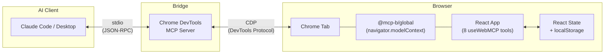
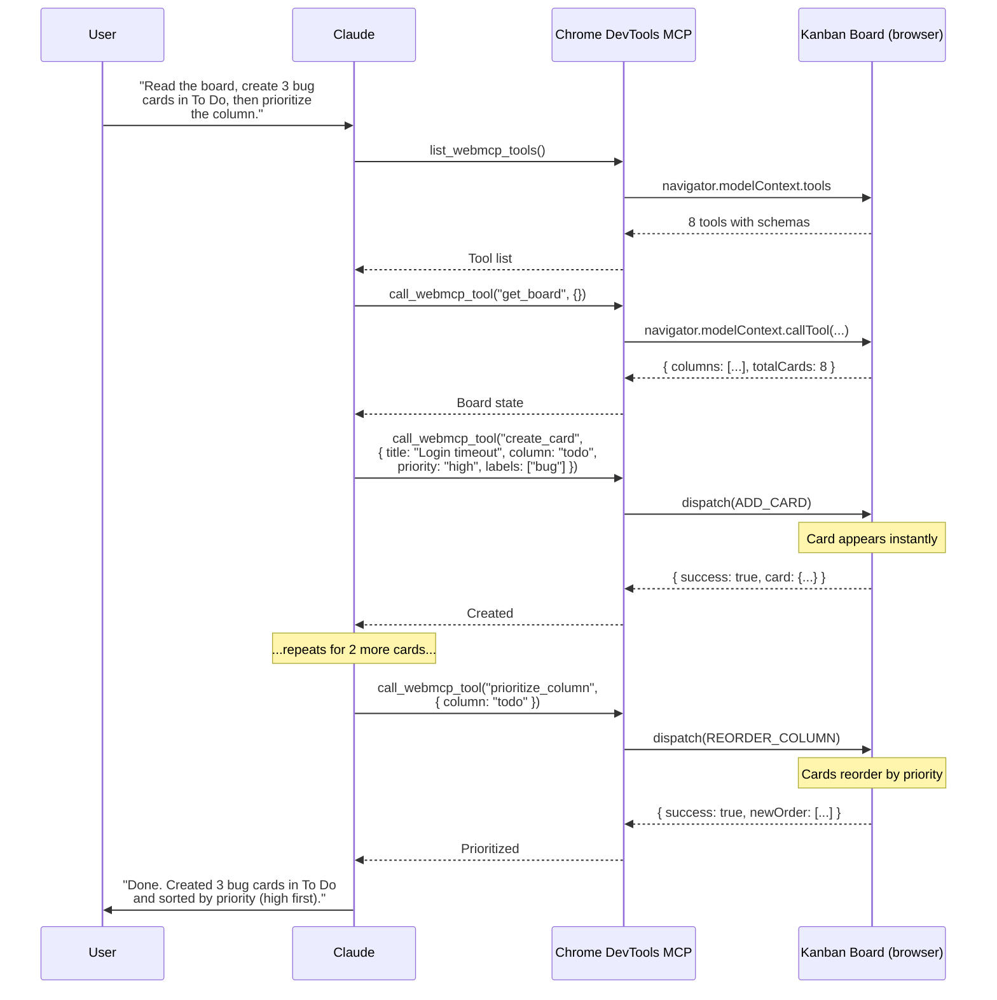

# Connecting Claude to Your WebMCP App via Chrome DevTools MCP

*Part 4 of 4: Building a browser-native AI integration with zero backend*

---

## Introduction

In Parts [1](./blog-webmcp-kanban-why.md), [2](./blog-webmcp-kanban-implementation.md), and [3](./blog-webmcp-kanban-vs-traditional.md), we built a kanban board with 8 WebMCP tools, walked through the implementation, and compared it to the traditional MCP approach. But we left a gap: the tools are registered in the browser, and no AI agent is calling them.

This post closes that gap. The [`@mcp-b/chrome-devtools-mcp`](https://docs.mcp-b.ai/packages/chrome-devtools-mcp) package is a fork of Google's Chrome DevTools MCP server that adds WebMCP tool discovery. It connects Claude Code, Claude Desktop, Cursor, or any MCP-compatible client to the tools registered on your page — through Chrome's DevTools Protocol.

One command to set up. Zero changes to the kanban app.

---

## The Bridge Architecture

The system has four layers. Three of them already exist; the Chrome DevTools MCP server is the one new component.



The data flow for a single tool call:

1. Claude calls `call_webmcp_tool({ name: 'create_card', args: { title: 'Fix login bug', column: 'todo' } })` over stdio
2. The Chrome DevTools MCP server receives the request and translates it into a CDP `Runtime.evaluate` call
3. Chrome executes `navigator.modelContext.callTool('create_card', { title: 'Fix login bug', column: 'todo' })` in the page context
4. The `useWebMCP` handler fires, dispatches `ADD_CARD` to the reducer, React re-renders, the card appears on screen
5. The handler returns `{ success: true, card: { id: '...', title: 'Fix login bug', ... } }`
6. The result travels back through CDP to the MCP server, then over stdio to Claude

The entire round trip is: stdio → CDP → JavaScript → React dispatch → re-render → JavaScript return → CDP → stdio. No HTTP. No database. No polling.

---

## Setup

### Claude Code

One command:

```bash
claude mcp add chrome-devtools npx @mcp-b/chrome-devtools-mcp@latest
```

Or, if you're working inside the `webmcp-kanban/` directory, the project includes a `.claude/settings.json` that pre-configures this automatically.

### Claude Desktop

Add to `claude_desktop_config.json`:

```json
{
  "mcpServers": {
    "chrome-devtools": {
      "command": "npx",
      "args": ["-y", "@mcp-b/chrome-devtools-mcp@latest"]
    }
  }
}
```

Restart Claude Desktop after editing the config.

### What Happens Under the Hood

When the MCP server starts, it:

1. Launches or connects to a Chrome instance via the DevTools Protocol
2. Exposes ~30 standard browser automation tools (navigate, click, screenshot, etc.)
3. Adds two WebMCP-specific tools: `list_webmcp_tools` and `call_webmcp_tool`

When Claude navigates to your kanban board, the page loads `@mcp-b/global`, which injects `navigator.modelContext`. The `useWebMCP` hooks register 8 tools against that API. Now `list_webmcp_tools` returns all 8 tools with their names, descriptions, and Zod-derived input schemas. `call_webmcp_tool` invokes any of them by name.

---

## Walkthrough: An Agent Session

Here is a concrete multi-step interaction. The user asks Claude to organize the board.



The user watches the cards appear and reorder on screen as Claude works. There is no delay between the tool call completing and the UI updating — they are the same event.

---

## How Discovery Works

The Chrome DevTools MCP server doesn't know about kanban boards, cards, or columns. It discovers tools dynamically by querying the page.

**`list_webmcp_tools`** executes the equivalent of:

```javascript
// Runs in the browser via CDP Runtime.evaluate
const tools = navigator.modelContext.tools
return tools.map(t => ({
  name: t.name,
  description: t.description,
  inputSchema: t.inputSchema,
}))
```

The result is a standard MCP tool list. Claude sees 8 tools with their descriptions and Zod-derived JSON schemas — the same information a developer would see reading the source code.

**`call_webmcp_tool`** executes:

```javascript
// Runs in the browser via CDP Runtime.evaluate
const result = await navigator.modelContext.callTool(name, args)
return result
```

The handler registered by `useWebMCP` runs in the page context with full access to React state and dispatch. The return value is serialized back through CDP to the MCP server, then to Claude.

**The polyfill is required.** Without `@mcp-b/global` imported before tool registration, `navigator.modelContext` does not exist, and `list_webmcp_tools` returns an empty list. Chrome 146+ has an experimental flag for native support (`chrome://flags` > "Experimental Web Platform features"), but the polyfill works today in any browser.

---

## WebMCP Tools vs. Screenshot-Based Automation

The Chrome DevTools MCP server also includes ~28 browser automation tools: `click`, `navigate_page`, `take_screenshot`, `fill`, `evaluate_script`, and more. These are the standard tools for AI-driven browser automation — parse a screenshot, identify elements, click coordinates, read the result.

WebMCP tools bypass all of that.

| Aspect | Screenshot-based | WebMCP tools |
|--------|-----------------|--------------|
| Input | Pixel coordinates, CSS selectors | Structured JSON with typed parameters |
| Output | Screenshot image (~2,000 tokens) | JSON result (~50-200 tokens) |
| Reliability | Fragile (layout changes break selectors) | Stable (tool API is the contract) |
| Speed | Screenshot → vision parse → action → screenshot | Tool call → result (single round trip) |
| Precision | "Click the blue button at (342, 187)" | `create_card({ title: "...", column: "todo" })` |

The token reduction is significant. A screenshot costs roughly 2,000 tokens every time the agent needs to see the current state. A `get_board` call returns structured JSON for a fraction of that. Over a multi-step workflow — read the board, create cards, move them, prioritize — the savings compound.

More importantly, the interaction model is different. Screenshot-based automation treats the web page as a visual surface to be parsed. WebMCP treats it as a structured API to be called. The agent doesn't need to understand what a kanban board looks like. It needs to understand what `create_card` and `move_card` do.

---

## Conclusion

The Chrome DevTools MCP server is the component that makes WebMCP practical today. Without it, `navigator.modelContext` is a browser API with no callers. With it, any MCP-compatible AI client — Claude Code, Claude Desktop, Cursor — can discover and invoke the tools your web app registers.

For the kanban board, this means:

- **Zero app changes.** The board already registers its tools via `useWebMCP`. The bridge discovers them automatically.
- **One setup command.** `claude mcp add chrome-devtools npx @mcp-b/chrome-devtools-mcp@latest` and you're connected.
- **Structured tool calls.** No screenshots, no selectors, no coordinate math. The agent calls `create_card` and gets back a card ID.
- **Real-time feedback.** The user watches cards appear and move as the agent works. Shared React state means zero sync delay.

The bridge completes the loop: tools registered in the browser, discoverable by any MCP client, callable with structured data, results visible in real time. This is what WebMCP was designed for — and now it actually works end to end.

---

*This is Part 4 of 4 in the WebMCP kanban board series. [Part 1](./blog-webmcp-kanban-why.md) covers why a kanban board is the right demo. [Part 2](./blog-webmcp-kanban-implementation.md) covers the implementation. [Part 3](./blog-webmcp-kanban-vs-traditional.md) compares WebMCP to traditional MCP.*
