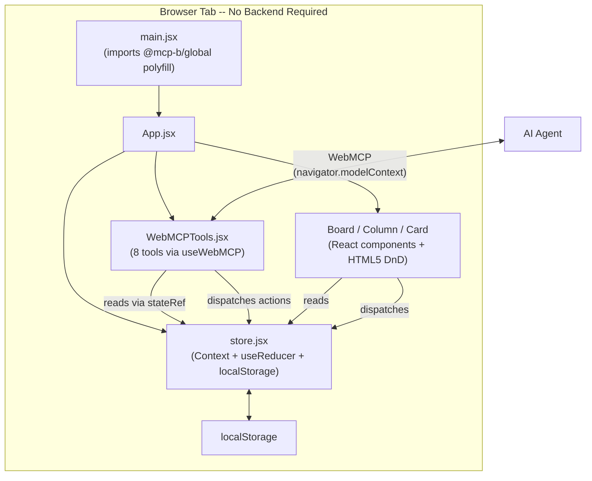
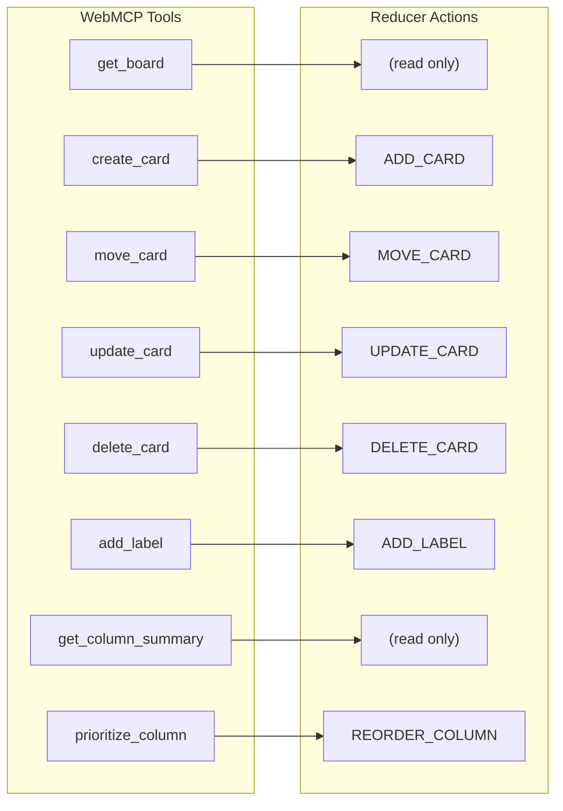

# Building a WebMCP Kanban Board: From React State to AI-Callable Tools

*Part 2 of 3: A technical walkthrough of building a pure client-side kanban board where every column and card is controllable by an AI agent -- no backend required.*

---

If you haven't read [Part 1](./blog-webmcp-kanban-why.md), start there for the motivation behind WebMCP and why exposing browser-side state to AI agents matters.

In this post, we walk through the full implementation of a kanban board built with:

- **React 18** with Vite for the build toolchain
- **Tailwind CSS** for styling
- **@mcp-b/react-webmcp** for registering AI-callable tools via the WebMCP browser standard
- **Zod** for tool parameter schemas and validation
- **Native HTML5 drag-and-drop** -- zero external DnD libraries

The entire application runs in a single browser tab. No backend server. No API routes. No database. State lives in `useReducer` and persists to `localStorage`.

---

## Architecture Overview

The architecture is deliberately flat. Five source files handle everything:



The key insight: `WebMCPTools.jsx` and the `Board` component tree are peers. They share the same store. The board renders state for humans; the tools expose state for AI agents. Both read from the same context and dispatch the same reducer actions.

---

## State Management

The store uses React's built-in `useReducer` wrapped in a Context provider. No Redux, no Zustand, no external state library.

### State Shape

```javascript
const initialState = {
  columns: ["backlog", "todo", "in-progress", "done"],
  columnMeta: {
    backlog:       { title: "Backlog",     color: "gray"   },
    todo:          { title: "To Do",       color: "blue"   },
    "in-progress": { title: "In Progress", color: "yellow" },
    done:          { title: "Done",        color: "green"  },
  },
  cards: [
    {
      id: "card-1",
      title: "Set up project scaffolding",
      description: "Initialize Vite + React + Tailwind",
      column: "done",
      priority: "high",
      labels: ["setup"],
    },
    // ... 7 more seed cards
  ],
}
```

Cards carry their column as a string field rather than being nested inside column arrays. This makes moves trivial -- update one field instead of splicing between two arrays.

### Reducer Actions

The reducer handles seven action types:

| Action | Purpose |
|--------|---------|
| `LOAD_BOARD` | Replace entire state (used on hydration from localStorage) |
| `ADD_CARD` | Push a new card into the cards array |
| `MOVE_CARD` | Change a card's `column` field |
| `UPDATE_CARD` | Merge partial updates into an existing card |
| `DELETE_CARD` | Filter a card out of the array by ID |
| `ADD_LABEL` | Append a label string to a card's labels array |
| `REORDER_COLUMN` | Replace the ordering of cards within a column |

### localStorage Sync

Every state change persists automatically:

```javascript
function BoardProvider({ children }) {
  const [state, dispatch] = useReducer(boardReducer, initialState)

  // Persist on every state change
  useEffect(() => {
    localStorage.setItem("kanban-board", JSON.stringify(state))
  }, [state])

  // Hydrate on mount
  useEffect(() => {
    const saved = localStorage.getItem("kanban-board")
    if (saved) {
      dispatch({ type: "LOAD_BOARD", payload: JSON.parse(saved) })
    }
  }, [])

  return (
    <BoardContext.Provider value={{ state, dispatch }}>
      {children}
    </BoardContext.Provider>
  )
}
```

On first visit, the board seeds itself with 8 example cards spread across the four columns. On subsequent visits, it hydrates from localStorage.

---

## The stateRef Pattern

This is the most important pattern in the codebase. Get it wrong and every tool handler will read stale state.

### The Problem

`useWebMCP` registers tool handlers as closures. React closures capture variables from the render in which they were created. If a handler references `state` directly, it captures whatever `state` was when the hook last ran -- not the current state at the moment the AI agent calls the tool.

```javascript
// BROKEN: state is captured once and never updates
useWebMCP("get_board", {
  schema: z.object({}),
  handler: () => {
    return state // stale! frozen at registration time
  },
})
```

An AI agent calls `get_board`, gets back the initial seed data, creates three cards, calls `get_board` again -- and still sees the seed data. The dispatches worked, the UI updated, but the tool handler is reading from a stale closure.

### The Solution

A `useRef` that always points to the latest state:

```javascript
const stateRef = useRef(state)
useEffect(() => { stateRef.current = state }, [state])
// In handlers: read stateRef.current instead of state
```

Three lines. The ref object itself is stable across renders -- its identity never changes. The effect updates its `.current` property after every state change. When a tool handler reads `stateRef.current`, it always gets the latest state regardless of when the closure was created.

```javascript
// CORRECT: stateRef.current is always fresh
useWebMCP("get_board", {
  schema: z.object({}),
  handler: () => {
    return stateRef.current // always current
  },
})
```

This pattern applies any time you pass callbacks to a registration-style API from within React. WebMCP tools, WebSocket message handlers, event bus subscriptions -- anywhere the callback outlives the render that created it.

---

## Tool Registration Walkthrough

The app registers 8 tools with WebMCP. Let's walk through two in detail to see the full pattern.

### create_card

This tool lets an AI agent add a new card to any column on the board.

```javascript
useWebMCP("create_card", {
  description: "Create a new card on the kanban board",
  schema: z.object({
    title: z
      .string()
      .describe("The title of the card"),
    description: z
      .string()
      .optional()
      .default("")
      .describe("A longer description of the card's content"),
    column: z
      .enum(["backlog", "todo", "in-progress", "done"])
      .optional()
      .default("backlog")
      .describe("Which column to place the card in"),
    priority: z
      .enum(["low", "medium", "high", "critical"])
      .optional()
      .default("medium")
      .describe("Priority level of the card"),
    labels: z
      .array(z.string())
      .optional()
      .default([])
      .describe("Tags or labels to attach to the card"),
  }),
  handler: ({ title, description, column, priority, labels }) => {
    const id = `card-${Date.now()}`
    dispatch({
      type: "ADD_CARD",
      payload: { id, title, description, column, priority, labels },
    })
    return { success: true, id, message: `Card "${title}" created in ${column}` }
  },
})
```

A few things to notice:

**Zod `.describe()` annotations are the AI's documentation.** When an AI agent discovers this tool through `navigator.modelContext`, those description strings are what it reads to understand each parameter. Write them like you're writing API docs for a developer who can't see your source code. "Which column to place the card in" is more useful than "column" alone.

**`.optional().default()` provides safe defaults.** The agent can call `create_card({ title: "Fix login bug" })` without specifying column, priority, or labels. Everything falls back to sensible defaults. This reduces the friction for the AI -- fewer required parameters means fewer chances for a malformed call.

**The handler dispatches a single action and returns a result.** The return value goes back to the AI agent. Including the generated `id` lets the agent reference this card in subsequent tool calls (move it, update it, delete it) without having to call `get_board` again.

### prioritize_column

This tool is more interesting because it reads state, performs logic, and then dispatches.

```javascript
useWebMCP("prioritize_column", {
  description:
    "Sort all cards in a column by priority (critical > high > medium > low)",
  schema: z.object({
    column: z
      .enum(["backlog", "todo", "in-progress", "done"])
      .describe("The column to sort by priority"),
  }),
  handler: ({ column }) => {
    const current = stateRef.current
    const columnCards = current.cards.filter((c) => c.column === column)

    const priorityOrder = { critical: 0, high: 1, medium: 2, low: 3 }
    const sorted = [...columnCards].sort(
      (a, b) => priorityOrder[a.priority] - priorityOrder[b.priority]
    )

    dispatch({
      type: "REORDER_COLUMN",
      payload: {
        column,
        cardIds: sorted.map((c) => c.id),
      },
    })

    return {
      success: true,
      message: `Sorted ${columnCards.length} cards in "${column}" by priority`,
      order: sorted.map((c) => ({ id: c.id, title: c.title, priority: c.priority })),
    }
  },
})
```

This is where the `stateRef` pattern pays off. The handler reads `stateRef.current` to get the live list of cards, filters to the target column, sorts by priority rank, and dispatches `REORDER_COLUMN` with the new ID ordering. If it read `state` directly, it would sort based on stale data and potentially reorder cards that no longer exist.

The return value includes the sorted order so the AI agent can confirm the result without making a follow-up `get_board` call.

---

## Tool-to-Action Mapping

Every tool maps to either a read operation or exactly one reducer action. No tool dispatches multiple actions. No tool has side effects beyond the dispatch.



This 1:1 mapping is intentional. It makes the system predictable. When an AI agent calls `move_card`, exactly one thing happens: a card's `column` field changes. There are no cascading effects, no middleware, no sagas. The reducer is a pure function. The tool handler is a thin wrapper that validates input (via Zod), dispatches the action, and returns a result.

Two tools -- `get_board` and `get_column_summary` -- are read-only. They access state through `stateRef.current` and return data without dispatching anything.

---

## Drag-and-Drop Without Libraries

The board supports manual drag-and-drop using native HTML5 DnD APIs. No `react-beautiful-dnd`, no `@dnd-kit`, no external libraries. The implementation is roughly 30 lines of event handlers spread across the `Card` and `Column` components.

Drag-and-drop implementation adapted from patterns described by [surajon.dev](https://www.surajon.dev/building-a-kanban-board-with-drag-and-drop-in-react).

### Card: The Drag Source

```jsx
function Card({ card }) {
  const { dispatch } = useBoard()

  const handleDragStart = (e) => {
    e.dataTransfer.setData("text/plain", card.id)
    e.dataTransfer.effectAllowed = "move"
    e.currentTarget.style.opacity = "0.5"
  }

  const handleDragEnd = (e) => {
    e.currentTarget.style.opacity = "1"
  }

  return (
    <div
      draggable="true"
      onDragStart={handleDragStart}
      onDragEnd={handleDragEnd}
      className="bg-white rounded-lg shadow p-3 cursor-grab active:cursor-grabbing"
    >
      <h3 className="font-medium text-sm">{card.title}</h3>
      {/* ... priority badge, labels, description */}
    </div>
  )
}
```

Three things happen on drag start:

1. **`dataTransfer.setData()`** stashes the card ID as plain text. This is the only data that crosses the drag boundary -- the drop target retrieves it to know which card was dragged.
2. **`effectAllowed = "move"`** tells the browser this is a move operation, which affects the cursor icon.
3. **Opacity drops to 0.5** to give visual feedback that the card is being dragged. It resets to 1 on `dragEnd`.

### Column: The Drop Target

```jsx
function Column({ columnId }) {
  const { state, dispatch } = useBoard()
  const [isDragOver, setIsDragOver] = useState(false)

  const handleDragOver = (e) => {
    e.preventDefault() // Required! Without this, drop is not allowed.
    setIsDragOver(true)
  }

  const handleDragLeave = (e) => {
    // Only clear if we're actually leaving the column,
    // not just entering a child element
    if (!e.currentTarget.contains(e.relatedTarget)) {
      setIsDragOver(false)
    }
  }

  const handleDrop = (e) => {
    e.preventDefault()
    setIsDragOver(false)

    const cardId = e.dataTransfer.getData("text/plain")
    if (cardId) {
      dispatch({
        type: "MOVE_CARD",
        payload: { cardId, targetColumn: columnId },
      })
    }
  }

  const columnCards = state.cards.filter((c) => c.column === columnId)

  return (
    <div
      onDragOver={handleDragOver}
      onDragLeave={handleDragLeave}
      onDrop={handleDrop}
      className={`flex flex-col rounded-lg p-3 min-h-[200px] transition-colors ${
        isDragOver ? "border-2 border-blue-400 bg-blue-50" : "border-2 border-transparent bg-gray-100"
      }`}
    >
      <h2 className="font-bold text-sm mb-3">{state.columnMeta[columnId].title}</h2>
      {columnCards.map((card) => (
        <Card key={card.id} card={card} />
      ))}
    </div>
  )
}
```

The critical gotcha: **`e.preventDefault()` in `onDragOver` is mandatory.** The browser's default behavior is to reject drops. If you forget this, `onDrop` will never fire and nothing will happen -- no error, no warning, just silent failure.

The `onDragLeave` handler includes a `contains()` check because drag-leave fires when the cursor enters a child element inside the column (like a card). Without this check, the visual highlight would flicker constantly as you drag over cards within the column. The `e.relatedTarget` check ensures we only clear the highlight when the cursor genuinely leaves the column's bounds.

The `onDrop` handler reads the card ID from `dataTransfer`, then dispatches the exact same `MOVE_CARD` action that the WebMCP `move_card` tool dispatches. Human drag-and-drop and AI tool calls go through the same code path.

---

## Conclusion

The entire app is roughly 500 lines of code across five files. No backend server. No API routes. No database process. Just React state exposed as AI-callable tools through a browser standard.

The architecture maps cleanly because we kept a strict discipline: each WebMCP tool either reads state or dispatches exactly one reducer action. The tools don't compose. They don't chain. They don't have side effects beyond the single dispatch. The AI agent composes them into sequences -- "get the board, create three cards, move the bug to in-progress, prioritize the todo column" -- and each call is an atomic operation against the reducer.

The `stateRef` pattern is the one piece of glue that makes this work inside React's closure model. Without it, tool handlers would read stale state and the AI agent would operate on a ghost board. Three lines of code solve the problem entirely.

Native HTML5 drag-and-drop keeps the dependency count at zero for the interaction layer. The same `MOVE_CARD` action fires whether a human drags a card or an AI agent calls `move_card`. The reducer doesn't know or care about the source.

*This is Part 2 of 4 in the WebMCP kanban board series. [Part 1](./blog-webmcp-kanban-why.md) covers why a kanban board is the right demo. [Part 3](./blog-webmcp-kanban-vs-traditional.md) compares WebMCP to traditional MCP. [Part 4](./blog-webmcp-kanban-bridge.md) connects Claude to the board via Chrome DevTools MCP.*
