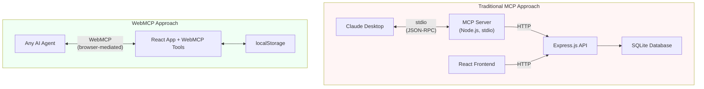
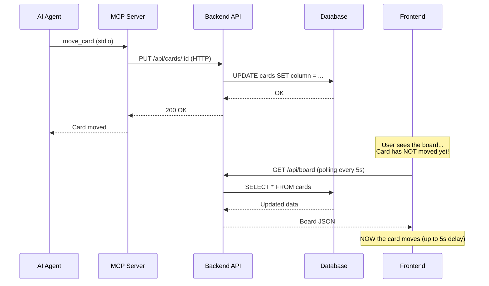
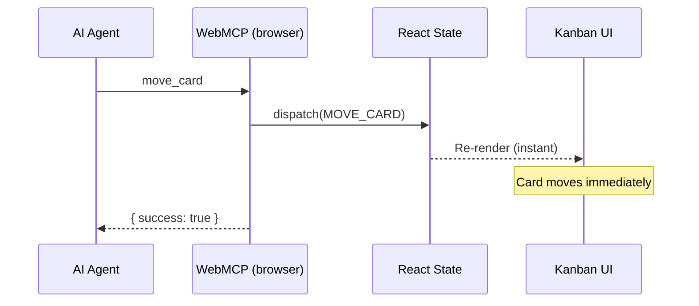

# What This Would Look Like With Traditional MCP

*Part 3 of 3: Building a browser-native AI integration with zero backend*

---

## Introduction

In [Part 1](./blog-webmcp-kanban-why.md), we explained why a kanban board is the ideal WebMCP demo: visible state changes, composable tools, zero backend. In [Part 2](./blog-webmcp-kanban-implementation.md), we walked through the full implementation -- React state, tool registration with Zod schemas, the stateRef pattern, and native drag-and-drop.

This final post asks the inverse question: what would it take to build the same kanban board -- 8 tools, drag-and-drop columns, real-time agent interaction -- using a traditional MCP server with stdio transport?

The WebMCP kanban board has zero backend. No database. No API server. No separate process. You run `npm run dev` and the entire system is live: board, tools, and agent interface, all in one browser tab.

To replicate that with traditional MCP, you need to build a lot more.

---

## The Traditional MCP Stack

Here is the architectural comparison at a glance:



The traditional approach requires five components across three processes. The WebMCP approach requires three components in a single process. That gap is not just a count of boxes in a diagram -- it represents real code you have to write, test, deploy, and maintain.

---

## What You'd Need to Build

### MCP Server (~200 lines)

The MCP server is a Node.js process that communicates with Claude Desktop over stdio using JSON-RPC. It must:

- Define all 8 tools with their input schemas (`get_board`, `create_card`, `move_card`, `update_card`, `delete_card`, `add_label`, `get_column_summary`, `prioritize_column`)
- Set up the stdio transport layer using `@modelcontextprotocol/sdk`
- Handle JSON-RPC request/response framing
- Make HTTP calls to the backend API for every tool invocation

Every tool handler follows the same pattern: validate input, make an HTTP request to Express, parse the response, return a result. The MCP server itself contains no business logic. It is a protocol adapter -- a translation layer between stdio JSON-RPC and HTTP REST.

```javascript
// Typical MCP tool handler -- pure boilerplate
server.setRequestHandler(CallToolRequestSchema, async (request) => {
  if (request.params.name === 'move_card') {
    const { cardId, toColumn } = request.params.arguments;
    const res = await fetch(`http://localhost:3005/api/cards/${cardId}`, {
      method: 'PUT',
      headers: { 'Content-Type': 'application/json' },
      body: JSON.stringify({ column: toColumn })
    });
    const data = await res.json();
    return { content: [{ type: 'text', text: JSON.stringify(data) }] };
  }
  // ... 7 more tools
});
```

In the WebMCP version, the equivalent handler is:

```javascript
navigator.modelContext.registerTool({
  name: 'move_card',
  description: 'Move a card to a different column',
  inputSchema: { /* ... */ },
  execute: ({ cardId, toColumn }) => {
    dispatch({ type: 'MOVE_CARD', cardId, toColumn });
    return { success: true };
  }
});
```

No HTTP call. No serialization. No separate process. The tool writes directly to React state.

### Express.js Backend (~300 lines)

The MCP server cannot access `localStorage` or React state. It needs a backend to persist data. That backend requires:

- **REST routes**: `POST /api/cards`, `PUT /api/cards/:id`, `DELETE /api/cards/:id`, `GET /api/board`, `POST /api/cards/:id/labels`, `GET /api/columns/:name/summary`, `PUT /api/columns/:name/order`
- **Request validation**: Check that required fields are present, column names are valid, card IDs exist
- **Database queries**: Parameterized SQL for every operation
- **Error handling**: 404 for missing cards, 400 for invalid input, 500 for database failures
- **CORS configuration**: The React frontend runs on a different port

This is a perfectly standard Express API. It is also entirely unnecessary in the WebMCP version, where React state and `localStorage` handle everything.

### Database Schema

The backend needs a persistent store. At minimum:

```sql
CREATE TABLE cards (
  id TEXT PRIMARY KEY,
  title TEXT NOT NULL,
  description TEXT DEFAULT '',
  priority INTEGER DEFAULT 0,
  column_name TEXT NOT NULL DEFAULT 'todo',
  position INTEGER NOT NULL DEFAULT 0,
  created_at DATETIME DEFAULT CURRENT_TIMESTAMP
);

CREATE TABLE labels (
  id INTEGER PRIMARY KEY AUTOINCREMENT,
  card_id TEXT NOT NULL,
  label TEXT NOT NULL,
  FOREIGN KEY (card_id) REFERENCES cards(id) ON DELETE CASCADE,
  UNIQUE(card_id, label)
);
```

You also need a migration strategy. Even for SQLite, you need to decide: do you run migrations at server startup? Do you use a migration library like `knex` or `better-sqlite3`? Do you version the schema? These are solved problems, but they are problems you have to solve -- problems that do not exist when your persistence layer is `localStorage.setItem('board', JSON.stringify(state))`.

### Frontend-Backend Sync

This is where the real cost appears. Without a sync mechanism, the agent and the user are looking at different data. The agent moves a card via MCP, the backend updates the database, but the React frontend still shows the card in its old column. The user sees nothing happen.

You have two options:

1. **Polling**: The frontend calls `GET /api/board` every N seconds. Simple, but introduces latency (up to N seconds of stale UI) and unnecessary network traffic when nothing has changed.

2. **WebSocket**: The backend pushes updates to the frontend in real time. Lower latency, but now you need a WebSocket server, connection management, reconnection logic, and a message protocol for board deltas.

Either way, you are writing infrastructure to solve a problem that does not exist in the WebMCP version. When the tool handler writes directly to React state, the UI re-renders in the same frame. There is no gap between "the data changed" and "the user sees the change."

### Configuration

The user must edit `claude_desktop_config.json` to register the MCP server:

```json
{
  "mcpServers": {
    "kanban": {
      "command": "node",
      "args": ["C:\\Users\\you\\projects\\kanban-mcp\\server.js"],
      "env": {
        "API_URL": "http://localhost:3005"
      }
    }
  }
}
```

This requires knowing the absolute path to the server script, the correct environment variables, and restarting Claude Desktop after every config change. WebMCP requires none of this -- the tools are registered when the page loads.

---

## The Sync Problem

The sync problem is the single largest difference between the two approaches, and it deserves its own section with concrete interaction diagrams.

### Traditional MCP: Delayed Sync



The agent receives confirmation that the card moved. The user is still looking at the old board. For up to 5 seconds (or whatever your polling interval is), the agent and the user disagree on the state of the board. If the user drags a card during that window, you have a conflict. If the user is watching the agent work in real time, the experience feels broken -- they asked the agent to move a card and nothing happened for 5 seconds.

WebSocket reduces the delay but does not eliminate the fundamental issue: state is stored in one place (the database) and rendered in another (the browser). Every change must traverse the network.

### WebMCP: Instant Sync



There is no delay. There is no network hop. There is no possibility of stale state. The tool handler dispatches an action, React re-renders, and the card moves on screen in the same frame. The agent's confirmation and the user's visual feedback arrive simultaneously because they share the same state object.

---

## Side-by-Side Comparison

| Aspect | Traditional MCP | WebMCP |
|--------|----------------|--------|
| Running processes | 3 (frontend, backend, MCP server) | 1 (Vite dev server) |
| Lines of integration code | ~500+ | ~200 |
| Database | SQLite or PostgreSQL | localStorage |
| Config files | 2+ (server config, claude_desktop_config) | 0 |
| Real-time sync | Requires WebSocket/polling | Automatic (shared React state) |
| Agent compatibility | Claude Desktop only (stdio) | Any WebMCP agent |
| Setup time | 15-30 minutes | `npm install && npm run dev` |
| Authentication | Manual env var configuration | N/A (browser session) |

Every row in this table reflects a genuine reduction in accidental complexity. The WebMCP kanban board is not a simpler application -- it has the same 8 tools, the same drag-and-drop interaction, the same card model. It is the same application with fewer moving parts.

---

## When Traditional MCP Is Still Better

This comparison would be incomplete without acknowledging where traditional MCP is the right choice.

**Multiple users on different machines need to share the same board.** WebMCP tools operate on browser-local state. If two people need to see the same kanban board, you need a server-side database and a sync protocol. Traditional MCP gives you that server by default.

**Data must persist beyond a single browser.** `localStorage` is tied to a browser profile on a single machine. If the user clears their browser data, the board is gone. A SQLite or PostgreSQL database survives browser resets, machine changes, and OS reinstalls.

**The AI agent needs to run headlessly without a browser open.** WebMCP requires a browser tab. If the agent is running in a CI pipeline, a cron job, or any environment without a display, it cannot discover WebMCP tools. Traditional MCP's stdio transport works anywhere Node.js runs.

**The web UI does not exist.** If the application is a pure API service with no frontend -- a data pipeline, a CLI tool, a background processor -- there is no browser for WebMCP to run in. Traditional MCP is the only option.

WebMCP is the right choice when the AI agent should interact with the same application the user is already using, in the same session. When the user and the agent are looking at the same screen, operating on the same state, in real time -- that is what WebMCP was designed for.

---

## Conclusion

For a single-user tool where the agent and user share the same context, WebMCP eliminates an enormous amount of accidental complexity. The traditional approach turns a 200-line integration into a 500+ line multi-process system with a sync problem to solve.

The kanban board makes this concrete. Eight tools. One board. Two actors (user and agent) operating on the same state. In the WebMCP version, that is all there is: tools registered in the browser, actions dispatched to React state, UI re-rendered instantly. In the traditional version, you need a protocol adapter (MCP server), a data layer (Express + SQLite), a sync mechanism (WebSocket or polling), and configuration glue to tie it all together.

None of those components are difficult to build. But all of them are unnecessary when the browser is the runtime.

---

*This is Part 3 of 4 in the WebMCP kanban board series. [Part 1](./blog-webmcp-kanban-why.md) covers why a kanban board is the right demo. [Part 2](./blog-webmcp-kanban-implementation.md) covers the implementation. [Part 4](./blog-webmcp-kanban-bridge.md) connects Claude to the board via Chrome DevTools MCP.*
