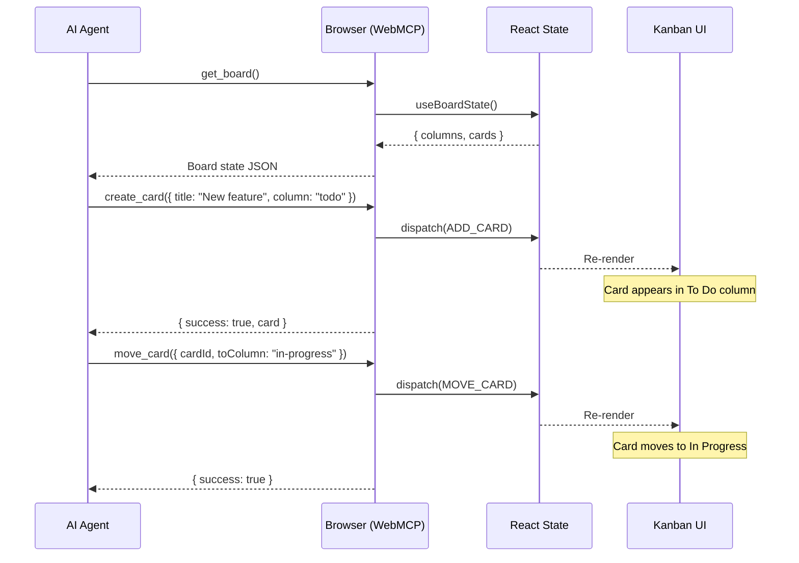
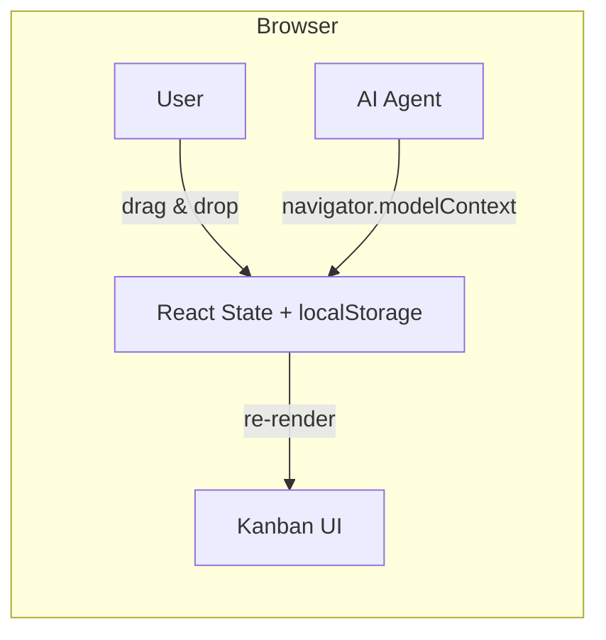

# Why a Kanban Board is the Perfect WebMCP Demo

*Part 1 of 3: Building a browser-native AI integration with zero backend*

---

## What is WebMCP?

[WebMCP](https://webmachinelearning.github.io/webmcp/) is a W3C draft browser API that lets websites register tools AI agents can discover and call -- directly through the browser. The API surface is `navigator.modelContext`: a standard interface where web applications declare structured tools, and any conforming AI agent can invoke them without proprietary bridges, plugins, or server-side orchestration.

The spec is still a draft, but the [@anthropic-ai/mcp-b-global](https://www.npmjs.com/package/@mcp-b/global) polyfill makes it usable today. A website registers its tools at page load, an agent discovers them via `navigator.modelContext.tools`, and calls them with structured input. The return value is plain JSON. That is the entire protocol.

This post explains why we chose a kanban board -- a pure client-side React app with 8 registered tools and no backend whatsoever -- as the demonstration vehicle for this standard.

---

## Why a Kanban Board?

There are three specific properties that make a kanban board unusually effective for demonstrating what WebMCP can do.

### 1. Visible State Changes

When an AI agent creates a card or moves it between columns, the result is immediately visible on the board. There is no sync delay. There is no polling interval. The agent writes to React state, React re-renders, and the card appears -- or moves -- on screen in the same frame.

This matters because WebMCP's core proposition is *shared browser context*. The agent operates on the same state the user is looking at. A kanban board makes that proposition visually self-evident: you watch the cards move in real time as the agent works.

### 2. Rich, Composable Tool Surface

A kanban board supports more than simple CRUD. The 8 tools we expose compose naturally into multi-step workflows:

- Read the board state
- Create a card in the To Do column
- Add a label to it
- Move it to In Progress
- Summarize all cards in a column
- Reprioritize the column by dragging cards into a new order

This composability matters. A demo with a single tool (say, a calculator) proves the protocol works but says nothing about whether it scales to real application logic. Eight tools that chain together into meaningful sequences demonstrate that WebMCP can support genuine agent autonomy over non-trivial application state.

### 3. Zero Backend Needed

All state lives in React Context and persists to `localStorage`. There is no database, no API server, no WebSocket connection. You run `npm run dev` and the entire demo -- board, tools, and agent interface -- is live.

This is not a limitation; it is the point. WebMCP's strength is that the agent interacts with application state *directly in the browser*. The kanban board proves that a fully functional agent integration requires nothing beyond the client. No backend to deploy. No API keys to configure for the board itself. No infrastructure to maintain.

---

## Agent Interaction Flow

The following diagram shows the full round-trip when an agent reads the board, creates a card, and moves it to a new column.

Every tool call follows this same pattern: the agent sends a structured request through `navigator.modelContext`, the polyfill routes it to the registered handler, the handler dispatches an action against React state, React re-renders the UI, and the handler returns a JSON result to the agent. The browser is the entire runtime.

---

## Shared Context is the Key Insight

The agent and the user see the same board. This is worth pausing on because it is fundamentally different from how traditional MCP works.

In a conventional MCP setup, the agent runs in one process and the UI runs in another. They communicate through a server, a message queue, or some other intermediary. State changes on one side must be explicitly synchronized to the other. This introduces latency, complexity, and an entire category of bugs around stale state and race conditions.

With WebMCP, there is no intermediary. React state is the single source of truth, and both the agent and the user operate on it directly:

- If the agent creates a card, the user sees it instantly.
- If the user drags a card to a different column, the agent's next `get_board()` call reflects the change.
- If the user deletes a card the agent just created, the agent gets a clear error on its next attempt to modify that card.

There is no sync protocol. No polling. No WebSocket. No conflict resolution layer. One state, two actors, zero coordination overhead.

Both the user and the agent converge on the same React state. The UI is just a projection of that state, always current for both parties.

---

## The 8 Tools

| Tool | Description |
|---|---|
| `get_board` | Returns the full board state: all columns, all cards, their positions, and labels. |
| `create_card` | Creates a new card in a specified column with a title and optional description. |
| `move_card` | Moves an existing card to a different column by card ID and target column. |
| `update_card` | Updates a card's title, description, or other mutable properties. |
| `delete_card` | Removes a card from the board entirely. |
| `add_label` | Attaches a label (e.g., "bug", "feature", "urgent") to an existing card. |
| `get_column_summary` | Returns an AI-friendly summary of all cards in a given column. |
| `prioritize_column` | Reorders cards within a column based on a provided priority ranking. |

The first five are standard CRUD operations. The last three -- `add_label`, `get_column_summary`, and `prioritize_column` -- exist to demonstrate that WebMCP tools can go beyond data manipulation into domain-specific actions that an agent can reason about and compose.

---

## Conclusion

This demo was chosen to maximize the *demonstrable impact* of WebMCP. The board is visual enough that you can see the agent's actions in real time. It is stateful enough that the tools compose into meaningful multi-step workflows. And it is simple enough that the entire application runs in the browser without a backend.

A kanban board is a small, familiar application -- but it exercises every property that makes WebMCP interesting: shared context, instant feedback, composable tools, and zero-infrastructure agent integration. That is why it is the demo.

---

*This is Part 1 of 4 in the WebMCP kanban board series. [Part 2](./blog-webmcp-kanban-implementation.md) covers the implementation. [Part 3](./blog-webmcp-kanban-vs-traditional.md) compares WebMCP to traditional MCP. [Part 4](./blog-webmcp-kanban-bridge.md) connects Claude to the board via Chrome DevTools MCP.*
