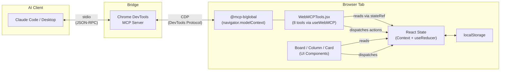
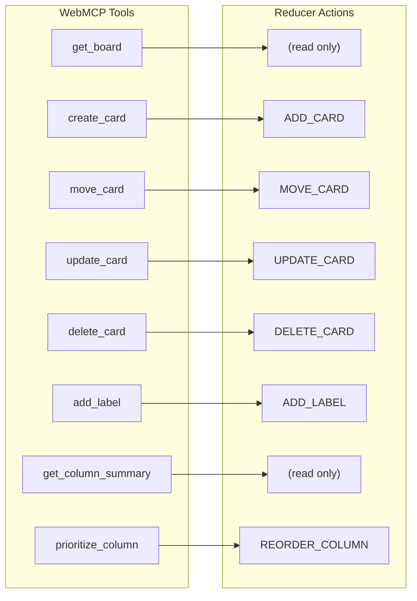
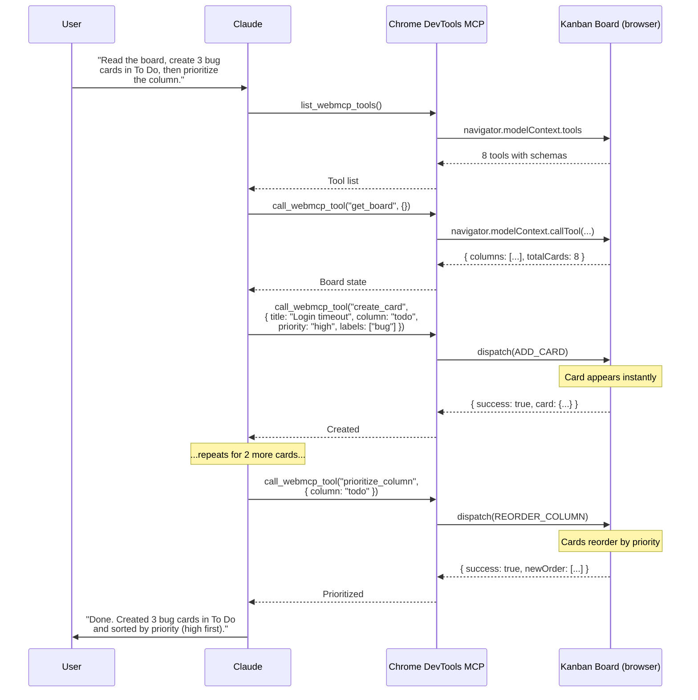
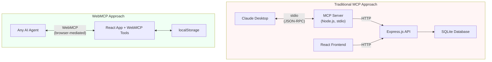
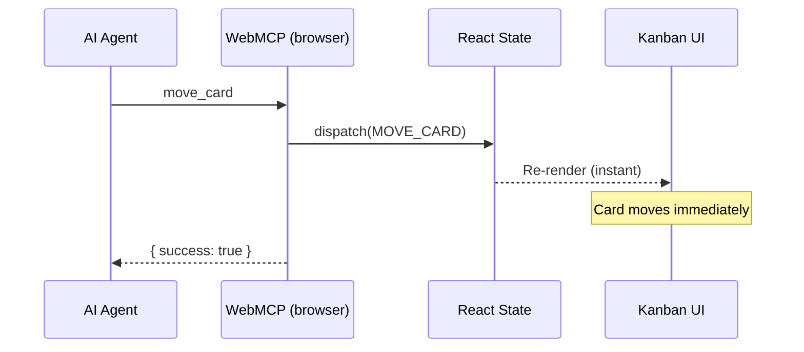
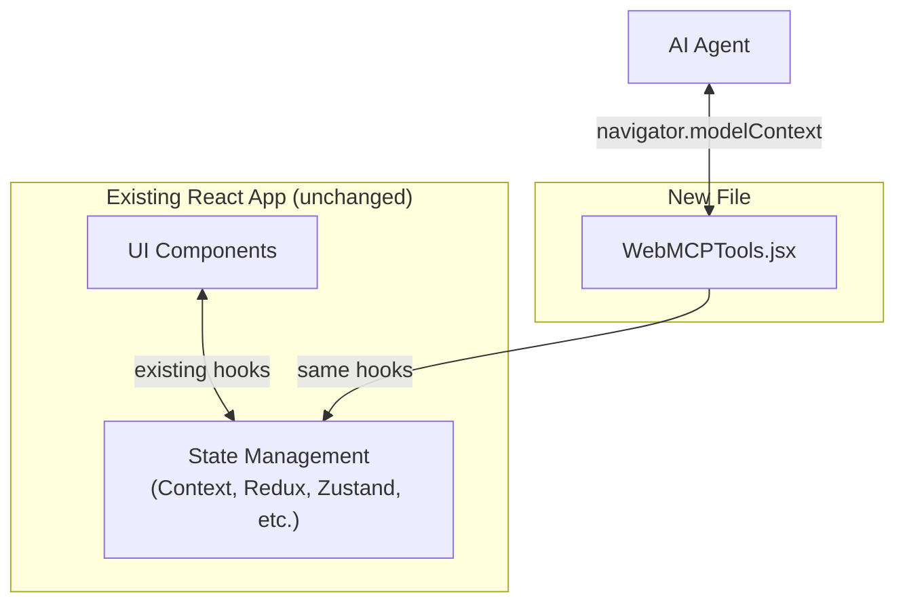

# Building a WebMCP Kanban Board: Browser-Native AI Integration With Zero Backend

---

## What is WebMCP?

[WebMCP](https://webmachinelearning.github.io/webmcp/) is a W3C draft browser API that lets websites register tools AI agents can discover and call -- directly through the browser. The API surface is `navigator.modelContext`: a standard interface where web applications declare structured tools, and any conforming AI agent can invoke them without proprietary bridges, plugins, or server-side orchestration.

The spec is still a draft, but the [@mcp-b/global](https://www.npmjs.com/package/@mcp-b/global) polyfill makes it usable today. A website registers its tools at page load, an agent discovers them via `navigator.modelContext.tools`, and calls them with structured input. The return value is plain JSON.

This post walks through a complete implementation: a kanban board built as a pure client-side React app with 8 AI-callable tools, connected to Claude through Chrome DevTools MCP. No backend. No database. No API server.

---

## Why a Kanban Board?

Three properties make a kanban board unusually effective for demonstrating WebMCP.

**Visible state changes.** When an AI agent creates a card or moves it between columns, the result is immediately visible. The agent writes to React state, React re-renders, and the card appears on screen in the same frame. You watch the agent work in real time.

**Rich, composable tools.** A kanban board supports more than simple CRUD. The 8 tools compose into multi-step workflows: read the board, create cards, add labels, move cards between columns, summarize a column, reprioritize by urgency. This demonstrates that WebMCP can support genuine agent autonomy over non-trivial application state.

**Zero backend.** All state lives in React Context and persists to `localStorage`. You run `npm run dev` and the entire system is live. This is not a limitation -- it is the point. WebMCP's strength is that the agent interacts with application state directly in the browser.

---

## Architecture

The entire system has four layers. The React app and WebMCP tools run in a single browser tab. The Chrome DevTools MCP server is the bridge that lets Claude reach them.



The key insight: `WebMCPTools.jsx` and the Board component tree are peers. They share the same store. The board renders state for humans; the tools expose state for AI agents. Both read from the same context and dispatch the same reducer actions.

### The 8 Tools

| Tool | Description |
|---|---|
| `get_board` | Returns the full board state: all columns, all cards, their positions, and labels. |
| `create_card` | Creates a new card in a specified column with a title and optional description. |
| `move_card` | Moves an existing card to a different column by card ID and target column. |
| `update_card` | Updates a card's title, description, or other mutable properties. |
| `delete_card` | Removes a card from the board entirely. |
| `add_label` | Attaches a label (e.g., "bug", "feature", "urgent") to an existing card. |
| `get_column_summary` | Returns an AI-friendly summary of all cards in a given column. |
| `prioritize_column` | Reorders cards within a column based on priority ranking. |

---

## Implementation

### State Management

The store uses React's built-in `useReducer` wrapped in a Context provider. No Redux, no Zustand, no external state library.

```javascript
const initialState = {
  columns: ["backlog", "todo", "in-progress", "done"],
  columnMeta: {
    backlog:       { title: "Backlog",     color: "gray"   },
    todo:          { title: "To Do",       color: "blue"   },
    "in-progress": { title: "In Progress", color: "yellow" },
    done:          { title: "Done",        color: "green"  },
  },
  cards: [
    {
      id: "card-1",
      title: "Set up project scaffolding",
      description: "Initialize Vite + React + Tailwind",
      column: "done",
      priority: "high",
      labels: ["setup"],
    },
    // ... 7 more seed cards
  ],
}
```

Cards carry their column as a string field rather than being nested inside column arrays. This makes moves trivial -- update one field instead of splicing between two arrays.

The reducer handles seven action types:

| Action | Purpose |
|--------|---------|
| `LOAD_BOARD` | Replace entire state (used on hydration from localStorage) |
| `ADD_CARD` | Push a new card into the cards array |
| `MOVE_CARD` | Change a card's `column` field |
| `UPDATE_CARD` | Merge partial updates into an existing card |
| `DELETE_CARD` | Filter a card out of the array by ID |
| `ADD_LABEL` | Append a label string to a card's labels array |
| `REORDER_COLUMN` | Replace the ordering of cards within a column |

Every state change persists automatically:

```javascript
function BoardProvider({ children }) {
  const [state, dispatch] = useReducer(boardReducer, initialState)

  useEffect(() => {
    localStorage.setItem("kanban-board", JSON.stringify(state))
  }, [state])

  useEffect(() => {
    const saved = localStorage.getItem("kanban-board")
    if (saved) {
      dispatch({ type: "LOAD_BOARD", payload: JSON.parse(saved) })
    }
  }, [])

  return (
    <BoardContext.Provider value={{ state, dispatch }}>
      {children}
    </BoardContext.Provider>
  )
}
```

### The stateRef Pattern

This is the most important pattern in the codebase. `useWebMCP` registers tool handlers as closures. React closures capture variables from the render in which they were created. If a handler references `state` directly, it captures whatever `state` was when the hook last ran -- not the current state at the moment the AI agent calls the tool.

```javascript
// BROKEN: state is captured once and never updates
useWebMCP("get_board", {
  schema: z.object({}),
  handler: () => {
    return state // stale! frozen at registration time
  },
})
```

The fix is a `useRef` that always points to the latest state:

```javascript
const stateRef = useRef(state)
useEffect(() => { stateRef.current = state }, [state])

// CORRECT: stateRef.current is always fresh
useWebMCP("get_board", {
  schema: z.object({}),
  handler: () => {
    return stateRef.current
  },
})
```

Three lines. The ref object is stable across renders. The effect updates `.current` after every state change. Tool handlers always get the latest state regardless of when the closure was created.

This pattern applies any time you pass callbacks to a registration-style API from within React: WebMCP tools, WebSocket handlers, event bus subscriptions -- anywhere the callback outlives the render that created it.

### Tool Registration

Each tool maps to either a read operation or exactly one reducer action.



Here is `create_card` in full:

```javascript
useWebMCP("create_card", {
  description: "Create a new card on the kanban board",
  schema: z.object({
    title: z
      .string()
      .describe("The title of the card"),
    description: z
      .string()
      .optional()
      .default("")
      .describe("A longer description of the card's content"),
    column: z
      .enum(["backlog", "todo", "in-progress", "done"])
      .optional()
      .default("backlog")
      .describe("Which column to place the card in"),
    priority: z
      .enum(["low", "medium", "high", "critical"])
      .optional()
      .default("medium")
      .describe("Priority level of the card"),
    labels: z
      .array(z.string())
      .optional()
      .default([])
      .describe("Tags or labels to attach to the card"),
  }),
  handler: ({ title, description, column, priority, labels }) => {
    const id = `card-${Date.now()}`
    dispatch({
      type: "ADD_CARD",
      payload: { id, title, description, column, priority, labels },
    })
    return { success: true, id, message: `Card "${title}" created in ${column}` }
  },
})
```

Zod `.describe()` annotations are the AI's documentation -- those strings are what Claude reads to understand each parameter. `.optional().default()` provides safe defaults so the agent can call `create_card({ title: "Fix login bug" })` without specifying every field.

And `prioritize_column`, which reads state, performs logic, then dispatches:

```javascript
useWebMCP("prioritize_column", {
  description:
    "Sort all cards in a column by priority (critical > high > medium > low)",
  schema: z.object({
    column: z
      .enum(["backlog", "todo", "in-progress", "done"])
      .describe("The column to sort by priority"),
  }),
  handler: ({ column }) => {
    const current = stateRef.current
    const columnCards = current.cards.filter((c) => c.column === column)

    const priorityOrder = { critical: 0, high: 1, medium: 2, low: 3 }
    const sorted = [...columnCards].sort(
      (a, b) => priorityOrder[a.priority] - priorityOrder[b.priority]
    )

    dispatch({
      type: "REORDER_COLUMN",
      payload: {
        column,
        cardIds: sorted.map((c) => c.id),
      },
    })

    return {
      success: true,
      message: `Sorted ${columnCards.length} cards in "${column}" by priority`,
      order: sorted.map((c) => ({ id: c.id, title: c.title, priority: c.priority })),
    }
  },
})
```

This is where the `stateRef` pattern pays off. The handler reads live state, filters to the target column, sorts by priority, and dispatches `REORDER_COLUMN`. If it read `state` directly, it would sort based on stale data.

### Drag-and-Drop Without Libraries

The board supports manual drag-and-drop using native HTML5 DnD APIs. No external libraries. The Card component is the drag source:

```jsx
function Card({ card }) {
  const { dispatch } = useBoard()

  const handleDragStart = (e) => {
    e.dataTransfer.setData("text/plain", card.id)
    e.dataTransfer.effectAllowed = "move"
    e.currentTarget.style.opacity = "0.5"
  }

  const handleDragEnd = (e) => {
    e.currentTarget.style.opacity = "1"
  }

  return (
    <div
      draggable="true"
      onDragStart={handleDragStart}
      onDragEnd={handleDragEnd}
      className="bg-white rounded-lg shadow p-3 cursor-grab active:cursor-grabbing"
    >
      <h3 className="font-medium text-sm">{card.title}</h3>
    </div>
  )
}
```

The Column component is the drop target:

```jsx
function Column({ columnId }) {
  const { state, dispatch } = useBoard()
  const [isDragOver, setIsDragOver] = useState(false)

  const handleDragOver = (e) => {
    e.preventDefault() // Required! Without this, drop is not allowed.
    setIsDragOver(true)
  }

  const handleDragLeave = (e) => {
    if (!e.currentTarget.contains(e.relatedTarget)) {
      setIsDragOver(false)
    }
  }

  const handleDrop = (e) => {
    e.preventDefault()
    setIsDragOver(false)

    const cardId = e.dataTransfer.getData("text/plain")
    if (cardId) {
      dispatch({
        type: "MOVE_CARD",
        payload: { cardId, targetColumn: columnId },
      })
    }
  }

  // ...
}
```

The `onDrop` handler dispatches the exact same `MOVE_CARD` action that the WebMCP `move_card` tool dispatches. Human drag-and-drop and AI tool calls go through the same code path.

---

## Connecting Claude via Chrome DevTools MCP

The [`@mcp-b/chrome-devtools-mcp`](https://docs.mcp-b.ai/packages/chrome-devtools-mcp) package is a fork of Google's Chrome DevTools MCP server that adds WebMCP tool discovery. It connects any MCP-compatible client to the tools registered on your page through Chrome's DevTools Protocol.

### Setup

**Claude Code:**

```bash
claude mcp add chrome-devtools npx @mcp-b/chrome-devtools-mcp@latest
```

**Claude Desktop** -- add to `claude_desktop_config.json`:

```json
{
  "mcpServers": {
    "chrome-devtools": {
      "command": "npx",
      "args": ["-y", "@mcp-b/chrome-devtools-mcp@latest"]
    }
  }
}
```

### How Discovery Works

The Chrome DevTools MCP server doesn't know about kanban boards. It discovers tools dynamically by querying the page.

**`list_webmcp_tools`** runs in the browser via CDP:

```javascript
const tools = navigator.modelContext.tools
return tools.map(t => ({
  name: t.name,
  description: t.description,
  inputSchema: t.inputSchema,
}))
```

**`call_webmcp_tool`** invokes a tool by name:

```javascript
const result = await navigator.modelContext.callTool(name, args)
return result
```

The handler registered by `useWebMCP` runs in the page context with full access to React state and dispatch. The return value is serialized back through CDP to the MCP server, then to Claude.

### Agent Session Walkthrough



The user watches the cards appear and reorder on screen as Claude works. There is no delay between the tool call completing and the UI updating -- they are the same event.

### WebMCP Tools vs. Screenshot-Based Automation

The Chrome DevTools MCP server also includes ~28 browser automation tools: `click`, `navigate_page`, `take_screenshot`, `fill`, and more. WebMCP tools bypass all of that.

| Aspect | Screenshot-based | WebMCP tools |
|--------|-----------------|--------------|
| Input | Pixel coordinates, CSS selectors | Structured JSON with typed parameters |
| Output | Screenshot image (~2,000 tokens) | JSON result (~50-200 tokens) |
| Reliability | Fragile (layout changes break selectors) | Stable (tool API is the contract) |
| Speed | Screenshot → vision parse → action → screenshot | Tool call → result (single round trip) |
| Precision | "Click the blue button at (342, 187)" | `create_card({ title: "...", column: "todo" })` |

---

## WebMCP vs. Traditional MCP

What would it take to build the same kanban board using a traditional MCP server with stdio transport?



The traditional approach requires an MCP server (~200 lines of protocol adapter code), a backend API (~300 lines of Express routes, validation, and database queries), a database schema with migrations, CORS configuration, and -- critically -- a sync mechanism to keep the frontend updated when the agent changes data.

### The Sync Problem

Without a sync mechanism, the agent and the user are looking at different data.

**Traditional MCP** -- the agent moves a card, the backend updates the database, but the React frontend still shows the card in its old column. You need polling (up to N seconds of stale UI) or WebSockets (connection management, reconnection logic, message protocol).

**WebMCP** -- the tool handler dispatches an action, React re-renders, and the card moves on screen in the same frame. There is no gap between "the data changed" and "the user sees the change."



### Side-by-Side Comparison

| Aspect | Traditional MCP | WebMCP |
|--------|----------------|--------|
| Running processes | 3 (frontend, backend, MCP server) | 1 (Vite dev server) |
| Lines of integration code | ~500+ | ~200 |
| Database | SQLite or PostgreSQL | localStorage |
| Config files | 2+ (server config, claude_desktop_config) | 0 |
| Real-time sync | Requires WebSocket/polling | Automatic (shared React state) |
| Agent compatibility | Claude Desktop only (stdio) | Any WebMCP agent |
| Setup time | 15-30 minutes | `npm install && npm run dev` |

### When Traditional MCP Is Still Better

**Multiple users on different machines need to share the same board.** WebMCP tools operate on browser-local state. If two people need to see the same board, you need a server-side database and a sync protocol.

**Data must persist beyond a single browser.** `localStorage` is tied to a browser profile on a single machine. A database survives browser resets, machine changes, and OS reinstalls.

**The AI agent needs to run headlessly without a browser open.** WebMCP requires a browser tab. If the agent runs in CI, a cron job, or any environment without a display, traditional MCP's stdio transport works anywhere Node.js runs.

**The web UI does not exist.** If the application is a pure API service with no frontend, there is no browser for WebMCP to run in.

---

## MCP as Adapter vs. MCP-Native Apps vs. WebMCP

Beyond where the MCP server runs, there is a second question: what role does MCP play in the architecture?

### MCP as an Adapter Layer

You have a backend with an API, a frontend with a UI, and the MCP server is a thin translation layer that converts tool calls into API requests. The backend does not know or care whether a request came from a user clicking a button or an LLM invoking a tool.

```
User clicks "Add Card"  -->  Frontend  -->  POST /api/cards  -->  Backend
LLM calls create_card   -->  MCP Server -->  POST /api/cards  -->  Backend
```

The MCP server contains no business logic. It is a protocol adapter: JSON-RPC in, HTTP out. The backend owns validation, persistence, and business rules. The app works without MCP.

For a concrete example, the [ai-developer-tools-mcp](https://github.com/grzetich/ai-developer-tools-mcp) project demonstrates this pattern: a ~200-line MCP server wraps an existing REST API for AI developer tool analytics. The API handles authentication, rate limiting, and data queries. The MCP server just translates tool calls into `fetch()` requests and formats the JSON responses for Claude. The API has no idea it is being called by an LLM -- and that is the point.

The structural parallel to this kanban board is exact:

| | ai-developer-tools-mcp | webmcp-kanban |
|---|---|---|
| App | REST API (data platform) | React app (kanban board) |
| Bridge | MCP server (~200 lines) | WebMCPTools.jsx + Chrome DevTools MCP |
| Bridge's job | Tool calls → HTTP requests | Tool calls → `dispatch()` to React state |
| App changes needed | None | None |

Same pattern, different transport. One goes over HTTP to a backend. The other goes directly into browser state.

### MCP-Native Apps

In an MCP-native app, the MCP server *is* the application. There is no separate REST API -- the tools, resources, and prompts defined in MCP are the primary interface. Any UI built on top calls through MCP, not around it.

This pattern makes sense for tools designed primarily for LLM consumption: code analysis tools, data pipelines, documentation generators, dev tooling. The LLM is the intended user, and a traditional web UI is secondary or nonexistent.

### Comparison

| | MCP as Adapter | MCP-Native App | WebMCP |
|---|---|---|---|
| Existing app? | Drop-in, no refactor needed | Built from scratch for MCP | Drop-in for React apps |
| Primary UI | Web interface for humans | LLM is the primary consumer | Web interface, shared with LLM |
| Without an LLM | Fully functional | Limited or unusable | Fully functional |
| Architecture | Two layers (API + MCP) | Single layer (MCP is the API) | Single layer (browser is the runtime) |
| Complexity | More moving parts, but decoupled | Simpler, but coupled to MCP | Simplest for browser-based apps |

---

## A Retrofit Path for Existing React Apps

Everything described in this post was built alongside the kanban board. But it didn't have to be.

The kanban board's WebMCP integration lives in a single file: `WebMCPTools.jsx`. That file reads state through `useBoardState()` and writes state through `dispatch()` -- the same hooks the UI components use. It does not modify the board's reducer, its components, or its persistence logic. If you deleted `WebMCPTools.jsx`, the kanban board would still work exactly as before. If you added it back, the board would become AI-accessible again. The app itself never changes.

This pattern generalizes to any React application that manages state through hooks.

**If your app uses Context + useReducer**, you write tool handlers that call `dispatch()` with the same action types your components already use. The reducer doesn't know or care that the action came from an AI agent instead of a button click.

**If your app uses Redux**, the tool handlers call `store.dispatch()`. The reducers, middleware, and selectors all work unchanged.

**If your app uses Zustand, Jotai, or any hook-based store**, the tool handlers call the same setter functions your components call.

The integration is always the same shape: a new file that imports the existing store, registers tools against `navigator.modelContext`, and maps each tool to a read or write operation the app already supports. No refactoring. No new API layer. No changes to existing components.



For teams with large, established React applications, this is the key takeaway: WebMCP is not a rewrite. It is one file that gives an LLM the same access your components already have.

---

## Conclusion

The kanban board is a small, familiar application -- but it exercises every property that makes WebMCP interesting: shared context, instant feedback, composable tools, and zero-infrastructure agent integration.

The entire app is roughly 500 lines of code across five files. Each WebMCP tool either reads state or dispatches exactly one reducer action. The AI agent composes them into sequences -- "get the board, create three cards, move the bug to in-progress, prioritize the todo column" -- and each call is an atomic operation against the reducer.

For a single-user tool where the agent and user share the same context, WebMCP eliminates an enormous amount of accidental complexity. The traditional approach turns a 200-line integration into a 500+ line multi-process system with a sync problem to solve. None of those components are difficult to build. But all of them are unnecessary when the browser is the runtime.
